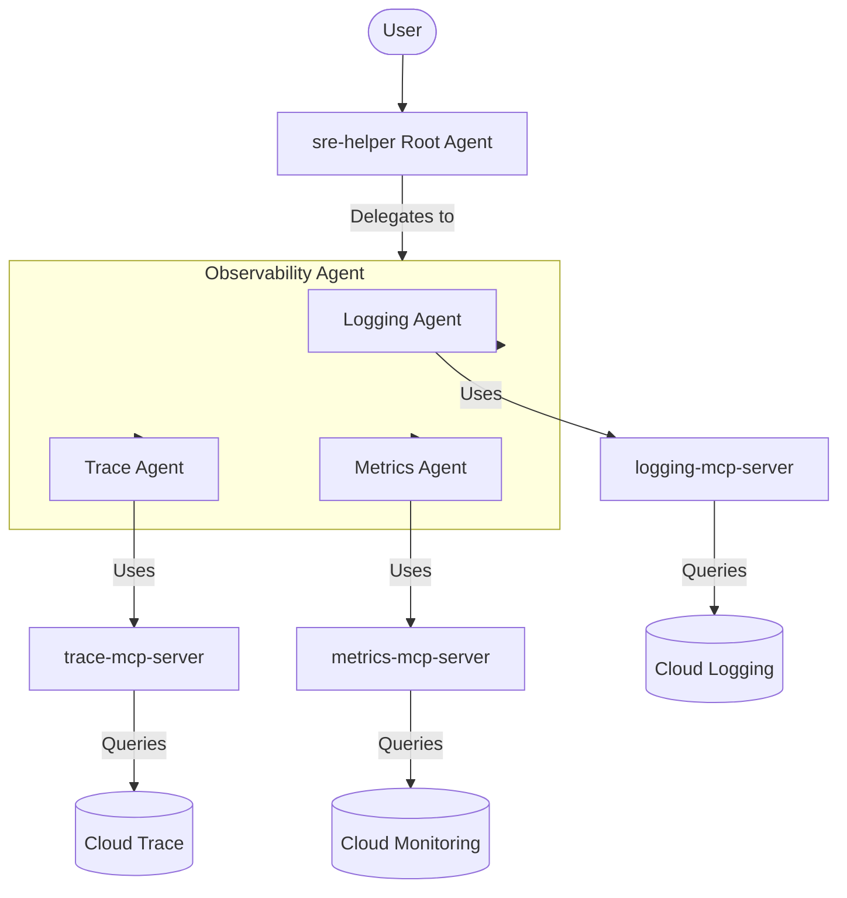

# System Architecture

This document describes the architecture of the AutoSRE system, which consists of a root agent orchestrating specialist observability agents.

## Overview

The system is designed to assist Site Reliability Engineers (SREs) in investigating incidents. It uses a multi-agent approach where a central orchestrator delegates tasks to specialized agents that have access to specific observability data sources via Model Context Protocol (MCP) servers.

## Component Diagram

The following diagram illustrates the relationship between the agents and the MCP servers.



## Components

### 1. SRE Helper (Root Agent)
- **File**: `sre-helper/app/agent.py`
- **Role**: Orchestrator for SRE incidents.
- **Model**: `gemini-2.5-flash`
- **Function**: Gathers incident details from the user and delegates the investigation to the `o11y-agent`.

### 2. Observability Agent (o11y-agent)
- **File**: `o11y-agent/app/agent.py`
- **Role**: Delegator for observability tasks.
- **Type**: `ParallelAgent`
- **Function**: Wraps specialist agents and allows them to run in parallel or as needed to answer queries. Exposed as an A2A (Agent-to-Agent) server.
  > [!NOTE]
  > In the current implementation, this agent only wraps the **Logging Agent** to allow successful execution without registry resolution errors for Trace and Metrics (which are not in the registry).

### 3. Specialist Agents
All specialist agents use `gemini-2.5-flash`.

- **Logging Agent**: Specialized in analyzing logs. Uses `logging-mcp-server`.
- **Trace Agent**: Specialized in analyzing traces. Uses `trace-mcp-server`.
- **Metrics Agent**: Specialized in analyzing metrics. Uses `metrics-mcp-server`.

### 4. MCP Servers
These servers provide tools for the agents to interact with Google Cloud services.
- **logging-mcp-server**: Tools for querying Cloud Logging.
- **trace-mcp-server**: Tools for querying Cloud Trace.
- **metrics-mcp-server**: Tools for querying Cloud Monitoring.

## Data Flow

1. The user interacts with the `sre-helper` agent describing an incident.
2. `sre-helper` identifies that it needs observability data and calls the `o11y-agent` (retrieved via `AgentRegistry`).
3. `o11y-agent` orchestrates the request among its sub-agents (Logging, Trace, Metrics).
4. Each sub-agent uses its specific MCP tool to query Google Cloud.
5. The results are aggregated and returned back to `sre-helper`, which then provides a consolidated response to the user.

## Security & Permissions

### Agent Registry Access
When deployed to Vertex AI Reasoning Engine, the agents may need to query the Cloud Agent Registry to resolve remote agents or MCP servers.

To allow this, the service account running the Reasoning Engine must be granted the **Agent Registry Viewer** role (`roles/agentregistry.viewer`) on the project.

**Example Command:**
```bash
gcloud projects add-iam-policy-binding <PROJECT_ID> \
    --member="serviceAccount:service-<PROJECT_NUMBER>@gcp-sa-aiplatform.iam.gserviceaccount.com" \
    --role="roles/agentregistry.viewer"
```
