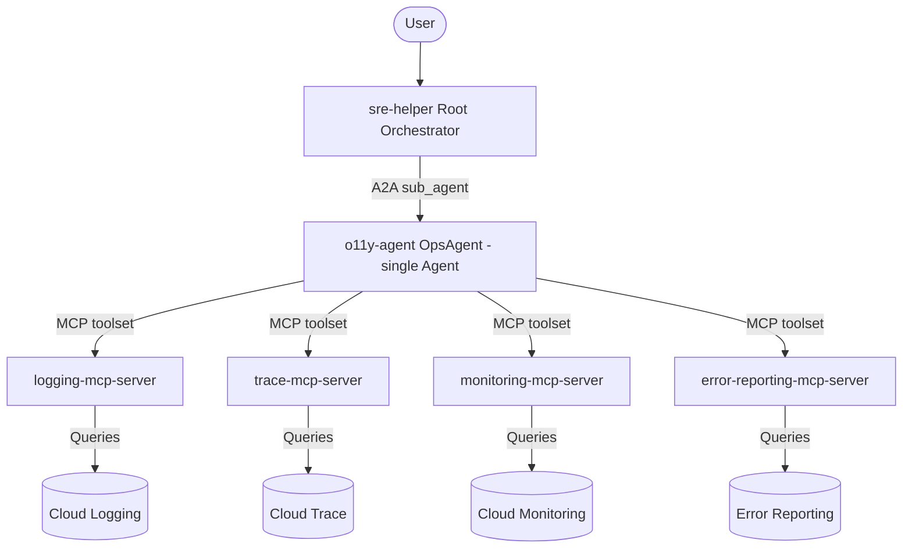

# System Architecture

This document describes the architecture of the AutoSRE system, which consists of a root orchestrator agent that delegates observability work to a specialist agent over A2A.

## Overview

The system is designed to assist Site Reliability Engineers (SREs) in investigating incidents. A central orchestrator (`sre-helper`) gathers context from the user and delegates observability tasks to a single specialist (`o11y-agent`), which accesses Google Cloud data via Model Context Protocol (MCP) servers.

## Component Diagram

The following diagram illustrates the relationship between the agents and the MCP servers.



## Components

### 1. SRE Helper (Root Orchestrator)
- **File**: `sre-helper/sre_helper/agent.py`
- **Role**: Orchestrator for SRE incidents.
- **Model**: `gemini-2.5-flash`
- **Function**: Gathers incident details from the user and delegates the investigation to the `o11y-agent`. Uses ADK's `AgentRegistry` to resolve the remote agent and wires it into `sub_agents` for direct delegation — no custom HTTP wrappers.

### 2. Observability Agent (o11y-agent)
- **File**: `o11y-agent/app/agent.py`
- **Role**: Specialist agent for observability tasks.
- **Type**: A single ADK `Agent` (`OpsAgent`) exposed as an A2A server.
- **Toolsets**: Four MCP toolsets resolved via `AgentRegistry`:
  - `logging-mcp-server` (Cloud Logging)
  - `trace-mcp-server` (Cloud Trace)
  - `monitoring-mcp-server` (Cloud Monitoring)
  - `error-reporting-mcp-server` (Error Reporting)
- **Model**: `gemini-2.5-flash`
- **Function**: Receives a task from `sre-helper` over A2A, plans which toolsets to call based on the investigation, and returns a consolidated analysis. There is no `ParallelAgent` and no sub-agents — the single `OpsAgent` decides which tools to invoke per request.

### 3. MCP Servers
These MCP servers — registered in Agent Registry and discovered by resource ID — provide tools for the `OpsAgent` to interact with Google Cloud services.
- **logging-mcp-server**: Tools for querying Cloud Logging.
- **trace-mcp-server**: Tools for querying Cloud Trace.
- **monitoring-mcp-server**: Tools for querying Cloud Monitoring.
- **error-reporting-mcp-server**: Tools for querying Error Reporting.

## Data Flow

1. The user interacts with the `sre-helper` agent describing an incident.
2. `sre-helper` identifies that it needs observability data and delegates to the `o11y-agent` (resolved via `AgentRegistry` and attached as a sub-agent).
3. `o11y-agent` (the `OpsAgent`) chooses which of its four MCP toolsets to call based on the task.
4. Each MCP server queries the corresponding Google Cloud service.
5. `o11y-agent` aggregates the tool results into a response; `sre-helper` consolidates it into the final answer to the user.

## Security & Permissions

### Agent Identity and Access Control

When deployed to Vertex AI Agent Engine, agents need permissions to access Agent Registry, query logs, and invoke MCP tools.

#### 1. SPIFFE Identity (Workload Identity Federation)
In this project environment, Agent Engine deployments are identified by a SPIFFE-formatted principal rather than a standard service account.

**Format:**
`principal://agents.global.org-<ORGANIZATION_ID>.system.id.goog/resources/aiplatform/projects/<PROJECT_NUMBER>/locations/<LOCATION>/reasoningEngines/<REASONING_ENGINE_ID>`

**Required Roles:**
- **Agent Registry Viewer** (`roles/agentregistry.viewer`): To resolve remote agents and MCP servers.
- **Logging Viewer** (`roles/logging.viewer`): To query Cloud Logging.
- **Cloud Trace Viewer** (`roles/cloudtrace.viewer`): To query Cloud Trace.
- **Monitoring Viewer** (`roles/monitoring.viewer`): To query Cloud Monitoring.
- **Error Reporting Viewer** (`roles/errorreporting.viewer`): To query Error Reporting.
- **MCP Tool User** (`roles/mcp.toolUser`): To invoke MCP tools.
- **Vertex AI User** (`roles/aiplatform.user`): Required on **both** caller and callee for A2A `reasoningEngines.query`.

Use `scripts/setup_iam.sh` to grant these roles. See [deployment_patterns.md](deployment_patterns.md#2-iam-permissions-for-a2a-and-mcp-tools) for details.

#### 2. Service Account Identity (Fallback)
If the agent falls back to the Platform Service Agent identity, the principal is:

`serviceAccount:service-<PROJECT_NUMBER>@gcp-sa-aiplatform-re.iam.gserviceaccount.com`

#### 3. Enabling Agent Identity during Deployment
To ensure the agent is provisioned with a SPIFFE identity, specify `identity_type=AGENT_IDENTITY` when creating the agent instance. Both deploy scripts in this repository do so.

**Using the Python SDK:**
```python
from vertexai import types

remote_app = client.agent_engines.create(
    agent=app,
    config={
        "display_name": "running-agent-with-identity",
        "identity_type": types.IdentityType.AGENT_IDENTITY,
        # ...
    },
)
```

#### 4. Deployment Method (Per-Agent Deploy Scripts)
Each agent has its own deploy script that handles the temp-directory staging described in [deployment_patterns.md §1](deployment_patterns.md#1-moduleNotFoundError-no-module-named-appagent) and sets `identity_type=AGENT_IDENTITY`.

**For `o11y-agent`:**
```bash
cd o11y-agent
uv sync
uv run python deploy.py
```

**For `sre-helper`:**
```bash
cd sre-helper
uv sync
uv run python deployment/deploy.py
```

Both scripts read `GOOGLE_CLOUD_PROJECT` and `GOOGLE_CLOUD_STORAGE_BUCKET` from the environment (see `.env.example`).
